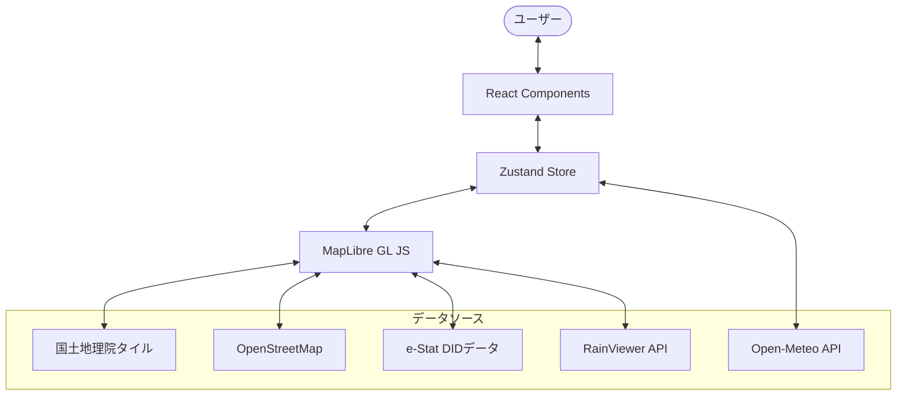

# システム概要図

## システム構成

このプロジェクトは、React、MapLibre GL JS、および各種地理空間データソースを組み合わせたフロントエンドアプリケーションです。



## ディレクトリ構造

```text
DIDinJapan/
├── public/             # 静的資産（GeoJSONデータ等）
├── src/
│   ├── components/    # UIコンポーネント
│   │   ├── drone/     # ドローン関連UI
│   │   ├── weather/   # 気象関連UI
│   │   └── icons/     # SVGアイコン
│   ├── lib/           # ビジネスロジック・ユーティリティ
│   │   ├── services/  # 外部API連携
│   │   ├── hooks/     # カスタムフック
│   │   └── utils/     # 地理計算等の小道具
│   ├── store/         # 状態管理 (Zustand)
│   ├── stories/       # Storybookドキュメント
│   └── App.tsx        # メインエントリーポイント
├── docs/              # 開発者・技術者向けドキュメント
└── scripts/           # データ変換スクリプト
```

## データフロー

1. **地図描画**: MapLibre GL JS が GSI/OSM からタイルを取得し、WebGLで描画します。
2. **オーバーレイ**: e-Statから取得したDID（人口集中地区）データをGeoJSONとして読み込み、地図上にレイヤーとして重ねます。
3. **外部連携**: ユーザーの操作や現在地に基づき、Open-Meteo API 等から最新の気象情報を取得し、Zustandストア経由でUIに反映します。
4. **衝突検出**: ユーザーが描画した飛行経路と、規制区域（DID/NFZ）との重なりを Turf.js および RBush を用いてリアルタイムに計算します。
