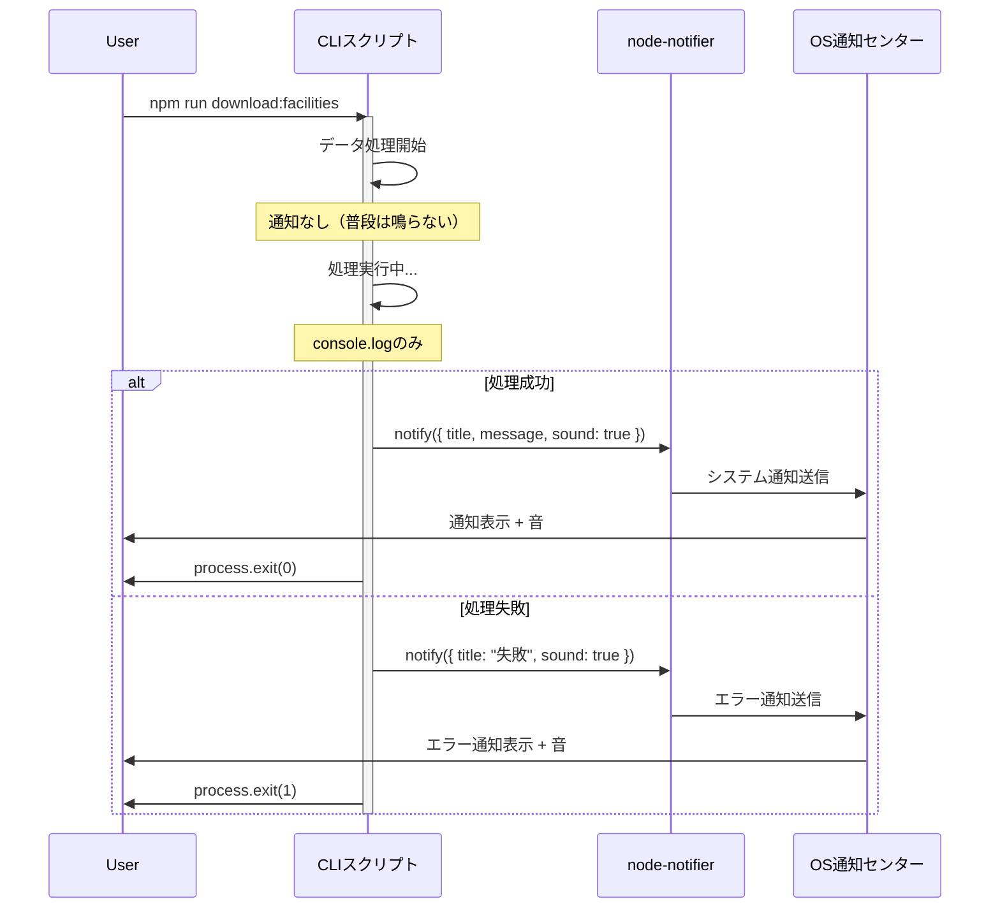

# CLI完了通知アーキテクチャ

## 概要

このドキュメントは、DIDinJapanプロジェクトにおけるCLIスクリプト完了通知システムのアーキテクチャを説明します。

### 目的

- CLIスクリプトが完了した際にシステム通知（音付き）を表示
- ユーザーが他の作業をしながらスクリプト完了を認識できるようにする
- 頻繁な通知を避け、スクリプト完了時のみ通知

## 技術スタック

| 技術 | バージョン | 用途 |
|------|-----------|------|
| node-notifier | latest | クロスプラットフォームのシステム通知 |
| Node.js | ES Modules | スクリプト実行環境 |

## アーキテクチャ概要

```
┌─────────────────────────────────────────────────────────┐
│                    CLIスクリプト                          │
├─────────────────────────────────────────────────────────┤
│                                                           │
│  1. データ処理開始                                        │
│     ├─ ログ出力（console.log）                          │
│     └─ 通知なし ✗                                        │
│                                                           │
│  2. 処理中                                                │
│     ├─ プログレス表示                                    │
│     └─ 通知なし ✗                                        │
│                                                           │
│  3. 完了 / エラー発生                                     │
│     ├─ ログ出力（console.log/error）                    │
│     └─ システム通知 + 音 ✓                              │
│                                                           │
└─────────────────────────────────────────────────────────┘
                            │
                            ▼
┌─────────────────────────────────────────────────────────┐
│               node-notifier ライブラリ                    │
├─────────────────────────────────────────────────────────┤
│  - タイトル設定                                           │
│  - メッセージ設定                                         │
│  - 音声通知 (sound: true)                                │
└─────────────────────────────────────────────────────────┘
                            │
                            ▼
┌─────────────────────────────────────────────────────────┐
│                  OS通知センター                           │
├─────────────────────────────────────────────────────────┤
│  macOS    : Notification Center                          │
│  Windows  : Windows Toast                                │
│  Linux    : notify-send                                  │
└─────────────────────────────────────────────────────────┘
```

## 対象スクリプト

| スクリプト | 用途 | 処理時間 |
|-----------|------|---------|
| `download_osm_facilities.js` | OSM施設データダウンロード | 中〜長 |
| `convert_gsi_2024.js` | GSI 2024標高データ変換 | 短〜中 |
| `convert_airport_data.js` | 空港データShapefile変換 | 短〜中 |
| `convert_did_2020.js` | DID 2020都道府県データ変換 | 中〜長 |

## 実装パターン

### パターン1: async/await関数型（download_osm_facilities.js）

```javascript
import notifier from 'node-notifier'

const run = async () => {
  // 処理ロジック...
  // データ取得、変換など

  // 成功時の通知（関数末尾）
  notifier.notify({
    title: 'OSM施設データダウンロード完了',
    message: 'すべてのデータ取得が完了しました',
    sound: true
  })
}

// エラーハンドリング
run().catch((error) => {
  console.error('Failed to download facilities:', error)
  notifier.notify({
    title: 'OSM施設データダウンロード失敗',
    message: 'エラーが発生しました',
    sound: true
  })
  process.exit(1)
})
```

### パターン2: try-catch型（convert_gsi_2024.js, convert_did_2020.js）

```javascript
import notifier from 'node-notifier'

try {
  // 同期処理...
  convertDEMToGeoJSON()
  generateElevationDifferenceInfo()

  // 成功時の通知
  notifier.notify({
    title: 'GSI 2024データ変換完了',
    message: '標高データの変換が完了しました',
    sound: true
  })
} catch (error) {
  console.error('Conversion failed:', error)

  // 失敗時の通知
  notifier.notify({
    title: 'GSI 2024データ変換失敗',
    message: 'エラーが発生しました',
    sound: true
  })
  process.exit(1)
}
```

### パターン3: 既存try-catchへの組み込み型（convert_airport_data.js）

```javascript
import notifier from 'node-notifier'

try {
  // 既存の処理...
  performDataConversion()
  console.log(`Success! Created ${OUTPUT_FILE}`)

  // 成功時の通知を追加
  notifier.notify({
    title: '空港データ変換完了',
    message: 'Shapefileの変換が完了しました',
    sound: true
  })
} catch (error) {
  console.error('Conversion failed:', error.message)

  // 失敗時の通知を追加
  notifier.notify({
    title: '空港データ変換失敗',
    message: 'エラーが発生しました',
    sound: true
  })
} finally {
  // クリーンアップ処理...
}
```

## 通知フロー



## 通知メッセージ仕様

### 成功時の通知フォーマット

```javascript
{
  title: '[処理名]完了',
  message: '[詳細メッセージ]',
  sound: true
}
```

### 失敗時の通知フォーマット

```javascript
{
  title: '[処理名]失敗',
  message: 'エラーが発生しました',
  sound: true
}
```

### 各スクリプトの通知内容

| スクリプト | 成功タイトル | 成功メッセージ | 失敗タイトル | 失敗メッセージ |
|-----------|-------------|---------------|-------------|---------------|
| download_osm_facilities | OSM施設データダウンロード完了 | すべてのデータ取得が完了しました | OSM施設データダウンロード失敗 | エラーが発生しました |
| convert_gsi_2024 | GSI 2024データ変換完了 | 標高データの変換が完了しました | GSI 2024データ変換失敗 | エラーが発生しました |
| convert_airport_data | 空港データ変換完了 | Shapefileの変換が完了しました | 空港データ変換失敗 | エラーが発生しました |
| convert_did_2020 | DID 2020データ変換完了 | すべての都道府県データの変換が完了しました | DID 2020データ変換失敗 | エラーが発生しました |

## 使用例

### 基本的な使い方

```bash
# OSM施設データをダウンロード（完了時に通知）
npm run download:facilities

# 他の作業をしながら待つ...
# → 完了すると通知音が鳴り、通知が表示される
```

### 想定ユースケース

1. **長時間処理の監視**
   - データダウンロード中に他のタスクに集中
   - 完了通知で処理終了を認識

2. **バックグラウンド実行**
   - ターミナルを最小化して他の作業
   - 音と通知で完了を察知

3. **エラー検知**
   - 処理失敗時もすぐに気づける
   - 即座に対応可能

## 技術的考慮事項

### 1. クロスプラットフォーム対応

`node-notifier`は以下のOSで自動的に適切な通知システムを使用：
- **macOS**: Notification Center
- **Windows**: Windows Toast
- **Linux**: notify-send (libnotify)

### 2. 通知タイミング

通知は以下のタイミングでのみ発火：
- ✅ スクリプト完全終了時（成功）
- ✅ スクリプトエラー終了時（失敗）
- ❌ 処理途中
- ❌ プログレス更新時

### 3. 音声通知

`sound: true`オプションにより：
- システムデフォルトの通知音を再生
- ユーザーのOS設定に従う
- 無音モードでは鳴らない

### 4. エラーハンドリング

各スクリプトは以下の戦略でエラーを処理：
- `try-catch`でラップ
- エラー時は通知 + `process.exit(1)`
- 既存のエラーログを保持

### 5. 非同期処理の考慮

`download_osm_facilities.js`のような非同期スクリプトでは：
- `async/await`の完了を待ってから通知
- `.catch()`でエラー通知を保証

## パフォーマンスへの影響

| 項目 | 影響度 | 詳細 |
|------|-------|------|
| 実行時間 | 極小（< 100ms） | 通知表示は非同期、スクリプト終了直前 |
| メモリ | 極小（< 5MB） | node-notifierは軽量ライブラリ |
| CPU | なし | OS通知システムが処理 |

## セキュリティ考慮事項

- 通知内容に機密情報を含めない
- エラーメッセージは一般的な内容に留める
- スクリプトの実行パスや内部情報を通知に含めない

## 今後の拡張性

### 追加可能な機能

1. **カスタム音声**
   ```javascript
   notifier.notify({
     title: '完了',
     message: 'データ処理完了',
     sound: '/path/to/custom-sound.wav'
   })
   ```

2. **通知アイコン**
   ```javascript
   notifier.notify({
     title: '完了',
     message: '処理完了',
     icon: '/path/to/icon.png'
   })
   ```

3. **処理時間の表示**
   ```javascript
   const startTime = Date.now()
   // 処理...
   const duration = ((Date.now() - startTime) / 1000).toFixed(1)
   notifier.notify({
     title: '完了',
     message: `処理時間: ${duration}秒`
   })
   ```

4. **統計情報の表示**
   ```javascript
   notifier.notify({
     title: 'ダウンロード完了',
     message: `${totalFiles}ファイル、${totalFeatures}件のデータ`
   })
   ```

## 実装の詳細

### インストール

```bash
npm install --save-dev node-notifier
```

### 各スクリプトへの組み込み

すべてのスクリプトは以下のステップで通知機能を追加：

1. **インポート追加**
   ```javascript
   import notifier from 'node-notifier'
   ```

2. **成功時の通知追加**
   - 処理完了直前に`notifier.notify()`を呼び出し

3. **失敗時の通知追加**
   - `catch`ブロック内で`notifier.notify()`を呼び出し

## トラブルシューティング

### 通知が表示されない場合

1. **OS通知設定を確認**
   - macOS: システム環境設定 > 通知
   - Windows: 設定 > システム > 通知
   - Linux: notify-sendがインストールされているか確認

2. **node-notifierの再インストール**
   ```bash
   npm uninstall node-notifier
   npm install --save-dev node-notifier
   ```

3. **権限の確認**
   - ターミナルに通知権限があるか確認

### 音が鳴らない場合

1. システムの音量設定を確認
2. OSの通知音設定を確認
3. マナーモード/サイレントモードを無効化

## 実装ファイル一覧

| ファイル | 変更内容 |
|---------|---------|
| `scripts/download_osm_facilities.js` | インポート追加、成功/失敗時通知追加 |
| `scripts/convert_gsi_2024.js` | インポート追加、try-catchラップ、通知追加 |
| `scripts/convert_airport_data.js` | インポート追加、既存try-catchに通知追加 |
| `scripts/convert_did_2020.js` | インポート追加、try-catchラップ、通知追加 |
| `package.json` | node-notifier依存関係追加 |

## 参考リンク

- [node-notifier GitHub](https://github.com/mikaelbr/node-notifier)
- [Node.js Process Exit Codes](https://nodejs.org/api/process.html#process_exit_codes)

---

**最終更新**: 2026-01-18
**バージョン**: 1.0.0
**作成者**: Claude Code
